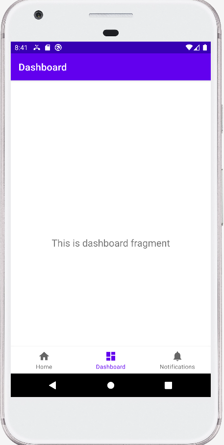
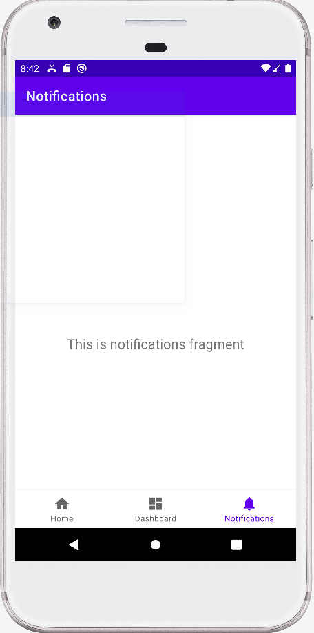

# Giao việc
Xây dựng giao diện app điện thoại

Tối chủ nhật (22/05/2022) báo cáo tiến độ

**Nếu có câu hỏi là làm thế nào để lấy danh bạ hay lịch sử: tự tìm hiểu**

Chú ý: Các hướng dẫn trên mạng chưa chắc có thể sử dụng được vì khác phiên bản android. Nên đọc doc của Android studio.

# Hải
Làm danh bạ ở trang này

- Làm cho đầy đủ tính năng như danh bạn mặc định ở trong máy
- Đầy đủ tính năng không chỉ bao gồm cái màn hình nhìn thấy, mà còn phải có cả các tương tác, vd như nhấn vào sđt thì làm sao, nhấn giữ thì làm sao. Bắt chước danh bạ điện thoại.
- Không được đụng vào các class DialerActivity, InCallServiceImplementation, MainActivity
- Có thể code một phần ui bằng cách chỉnh sửa class trong thư mục ui/dashboard
- Nhớ đổi cả tên và icon từ dashboard thành danh bạ

# anh Trí
Làm lịch sử gọi ở trang này

- Làm cho đầy đủ tính năng như lịch sử gọi mặc định ở trong máy
- Đầy đủ tính năng không chỉ bao gồm cái màn hình nhìn thấy, mà còn phải có cả các tương tác, vd như nhấn vào sđt thì làm sao, nhấn giữ thì làm sao. Bắt chước trnag lịch sử gọi.
- Không được đụng vào các class DialerActivity, InCallServiceImplementation, MainActivity
- Có thể code một phần ui bằng cách chỉnh sửa class trong thư mục ui/notifications
- Nhớ đổi tên và icon từ notifications thành lịch sử (hoặc gần đây)